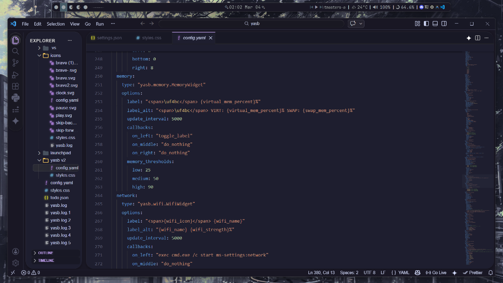

# 🏝️ VS Code Island Catppuccin Mocha

My custom VS Code configuration based on the Catppuccin Mocha theme.

## 📸 Preview

## 📁 Files Included

- `settings.json`: My main VS Code settings file

## 📥 Installation

1. Copy the contents of `settings.json` to your own VS Code `settings.json` file.
2. (You can access your settings by pressing `Ctrl + ,` and clicking the "Open Settings (JSON)" icon in the top right corner).
